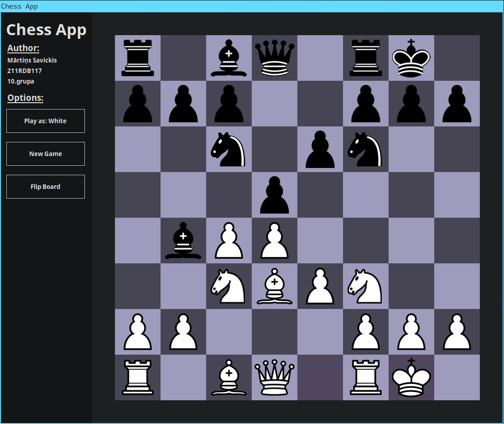

## Chess
A chess game built with Python. This was initially ment to be an RTU AI project but due to the complexity of the chess engine I had to scrap this idea and create a more simple version of chess that does not have any special moves. The finished project with the AI model will be found under the repository "**DSP332-Chess**". It does share a lot of similarities, but it does not have any special moves like "En Passant" and "Castles". The game still has a few bugs here and there but it still was a fun project.

**Preview:**

## Installation
**Packages**

Install required packages (Windows, Linux):

`` pip3 install -r requirements.txt ``

**Arch Linux**

The tkinter package is also required for Arch Linux:

`` sudo pacman -S tk ``
